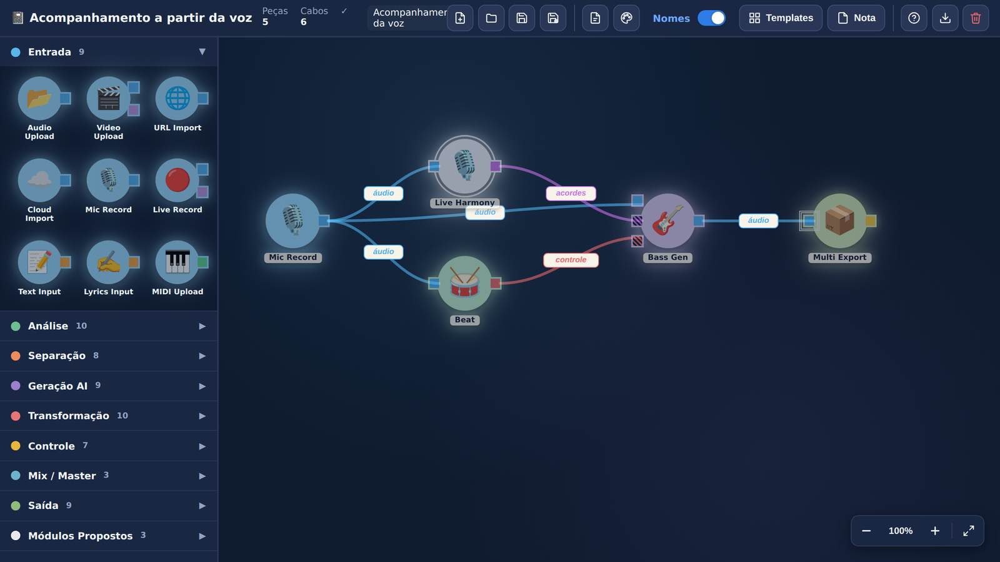

# 🎵 Music.AI Workflow — Mesa de Composição Visual

Interface visual estilo **REACTABLE** para compor workflows do [Music.AI](https://music.ai). Arraste módulos como peças tangíveis, conecte cabos entre eles, e monte fluxos de processamento de áudio de forma visual.



## 🎯 Sobre o projeto

Este é um **protótipo conceitual** de uma interface alternativa pra construir workflows do Music.AI. Em vez de configurar JSON ou usar dropdowns, você arrasta peças circulares (chamadas "pucks") que representam módulos de processamento, e conecta com cabos Bezier coloridos por tipo de dado.

Inspiração: a [REACTABLE](https://reactable.com), instrumento musical de mesa colaborativa onde você posiciona objetos físicos pra gerar som.

## ✨ Features

- **9 categorias de módulos** (~50 peças no total): Entrada, Análise, Separação, Geração AI, Transformação, Controle, Mix/Master, Saída, Módulos Propostos
- **8 tipos de dados** com cores próprias: Áudio, MIDI, Texto, Vídeo, Dados, Controle, Acordes, e suporte a "adaptador" entre tipos diferentes
- **Drag & drop** de peças com snap, posicionamento livre, e **multi-seleção** com retângulo de seleção
- **Cabos Bezier** com cor por tipo de dado, label editável, validação de compatibilidade
- **Adaptador automático** quando os tipos não batem: sistema mostra popup "Conexão incompatível", o cabo recebe gradiente entre as duas cores e marca visual no cruzamento
- **Sistema de arquivos**: Novo, Abrir, Salvar, Salvar como — múltiplos workflows nomeados no `localStorage`
- **Persistência** automática (autosave) + import/export JSON pra disco
- **Templates** pré-prontos pra começar rápido
- **Post-its** pra anotações livres no canvas
- **Zoom** com roda do mouse (centrado no cursor) + botões + atalhos
- **Menu de contexto** (botão direito) pra módulos e cabos
- **Tema de ícones** trocável: Custom SVG, Lucide, Tabler, Phosphor Duotone, Solar Bold, Emoji
- **Toggle visual** estilo iOS pra mostrar/ocultar nomes
- **Atalhos de teclado**: Ctrl+S/O/N/+/-/0, Delete, Cmd+Z, Cmd+D, Esc

## 🎼 Cenário de uso de exemplo

A imagem acima mostra um workflow que demonstra o conceito de "Bot-People Fit": gerar acompanhamento musical a partir da voz cantada do usuário.

```
Mic Record  ─── áudio ────►  Live Harmony  ─── acordes ────►  Bass Gen  ─── áudio ──► Multi Export
     │                       (proposto)                          ▲
     │                                                           │
     ├─── áudio ────►  Beat Detection  ─── controle ─────────────┘
     │
     └─── áudio ─────────────────────────────────────────────────► (entrada de áudio)
```

A linha de baixo recebe **3 tipos diferentes de informação** (áudio, acordes, controle de tempo) e gera o acompanhamento.

## 🚀 Como usar

A aplicação é **100% client-side**, sem backend. Tudo roda no browser.

1. Abra o site (ou faça download do `index.html` e abra direto)
2. Arraste módulos do painel da esquerda pro canvas
3. Conecte cabos clicando em um conector e arrastando até outro compatível
4. Use **botão direito** num módulo pra Renomear/Duplicar/Deletar
5. Use **Salvar/Salvar Como** pra criar uma biblioteca de workflows nomeados
6. Use **Exportar JSON** pra fazer backup ou compartilhar

### Atalhos úteis

| Atalho | Ação |
|---|---|
| `Ctrl/Cmd + N` | Novo workflow |
| `Ctrl/Cmd + O` | Abrir workflow salvo |
| `Ctrl/Cmd + S` | Salvar |
| `Ctrl/Cmd + Shift + S` | Salvar como… |
| `Ctrl/Cmd + Z` | Desfazer |
| `Ctrl/Cmd + D` | Duplicar selecionado |
| `Delete` | Apagar selecionado(s) |
| `Esc` | Limpar seleção |
| `Roda do mouse` | Zoom in/out (centrado no cursor) |
| `Ctrl/Cmd + +/-/0` | Zoom |
| `Shift + arrastar` | Selecionar com retângulo |

## 🔧 Arquitetura

- **HTML único** (`index.html`) sem build step, sem dependências de NPM em runtime
- **Bibliotecas via CDN**: [Iconify](https://iconify.design) (ícones), Google Fonts (Patrick Hand pros post-its)
- **256 SVGs raspados** da API Iconify (Lucide, Tabler, Phosphor, Solar) embutidos inline pra renderização instantânea sem requisições de rede
- **localStorage** pra autosave e biblioteca de workflows
- **MutationObserver** pra registrar handlers automaticamente em elementos novos no DOM

## 📦 Deploy

Hospedado na **Vercel** como site estático. Qualquer push pra `main` faz redeploy automático.

Pra rodar localmente, basta abrir o `index.html` num browser moderno — não precisa de servidor.

## 🎨 Tipos de dados (sistema de cores)

| Tipo | Cor | Exemplos de módulos que produzem |
|---|---|---|
| **Áudio** | Azul `#4FB0F0` | Audio Upload, Bass Gen, Mix |
| **MIDI** | Verde `#5BD18E` | MIDI Upload, MIDI Export |
| **Acordes** | Púrpura `#C870E8` | Chord Detection, Live Harmony |
| **Texto** | Laranja `#F0A040` | Text Input, Lyrics Generator |
| **Dados** | Amarelo `#F0C840` | BPM, Key, Time Signature |
| **Controle** | Vermelho `#E86868` | Beat Detection, Metronome |
| **Vídeo** | Lilás `#B894E0` | Video Upload, Cover Gen |

Cabos só conectam tipos compatíveis. Se você forçar tipos diferentes, o sistema avisa e marca o cabo com **adaptador** (gradiente entre as duas cores + linhas paralelas perpendiculares ao cabo).

## 📝 Status

Protótipo conceitual em desenvolvimento iterativo. Não é executável — não chama a API real do Music.AI. Serve como **briefing visual** pra equipes de produto/engenharia conversarem sobre fluxos de processamento de áudio.

## 🪪 Licença

Sem licença específica. Use, modifique, compartilhe — só me marca se chegar em algum lugar legal. 🎵
